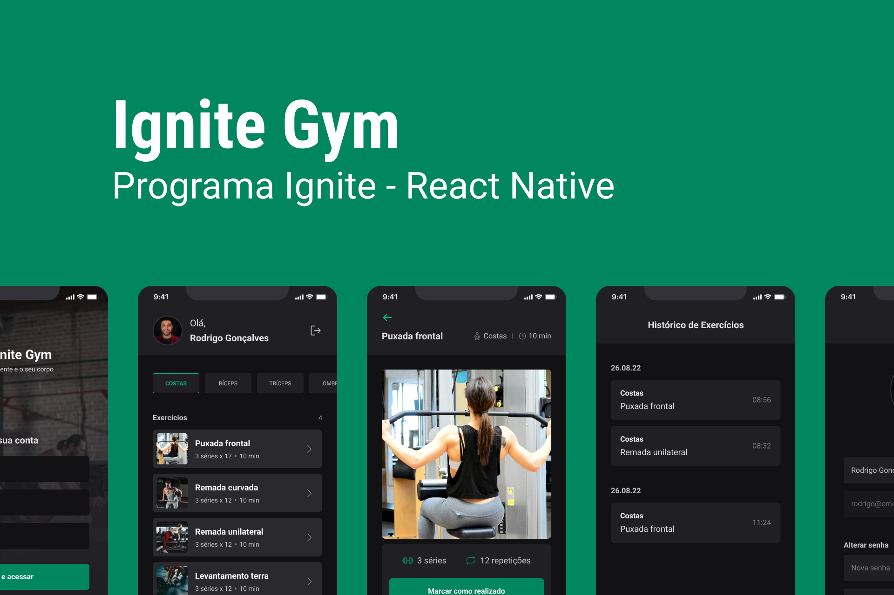

<h1 style="text-align: center; font-weight: bold;">Ignite Gym</h1>

<div align="center" >
  
</div>

## Sobre o Projeto

A ideia dessa aplicação é termos um app onde podemos consultar exercícios de academia. Nesse aplicativo vamos ter dois tipos de navegações, uma navegação em pilha para as rotas publicas e uma navegação em abas, na parte inferior para as rotas privadas. Para estilizar essa aplicação utilizaremos o NativeBase, uma biblioteca de componentes estilizados para facilitar na criação do app.

### Tecnologias Usadas

- [React Native](https://reactnative.dev/)
- [Expo](https://expo.io/)
- [TypeScript](https://www.typescriptlang.org/)
- [Native Base](https://nativebase.io/)
- [React Navigation](https://reactnavigation.org/)
- [Expo-Vector-Icons](https://icons.expo.fyi/)
- [Async Storage](https://react-native-async-storage.github.io/async-storage/)
- [Axios](https://axios-http.com/ptbr/docs/intro)
- [React Hook Form](https://react-hook-form.com/)

### Como rodar a aplicação

```bash
# Clone este repositório
$ git clone https://github.com/marrcelosantana/ignite-gym-app
# Acesse a pasta do projeto
$ cd ignite-gym-app
# Instale as dependências
$ npm install
# ou
$ yarn
# Execute a aplicação em modo de desenvolvimento
$ expo start

```

### Telas da aplicação

|              Login              |              Cadastro              |              Home              |
| :-----------------------------: | :--------------------------------: | :----------------------------: |
|  |  |  |

|             Detalhes              |             Histórico             |              Perfil               |
| :-------------------------------: | :-------------------------------: | :-------------------------------: |
|  |  |  |
